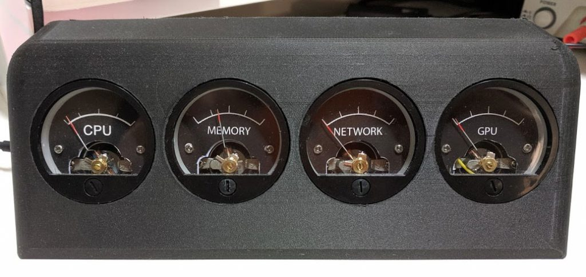

# DIY Analog Resource Monitor for your PC

This is a DIY project and guide on how to build a physical dashboard for your PC.

### See it in action

### Project homepage
Read more about it at https://sasakaranovic.com/projects/diy-analog-resource-monitor-for-your-pc/